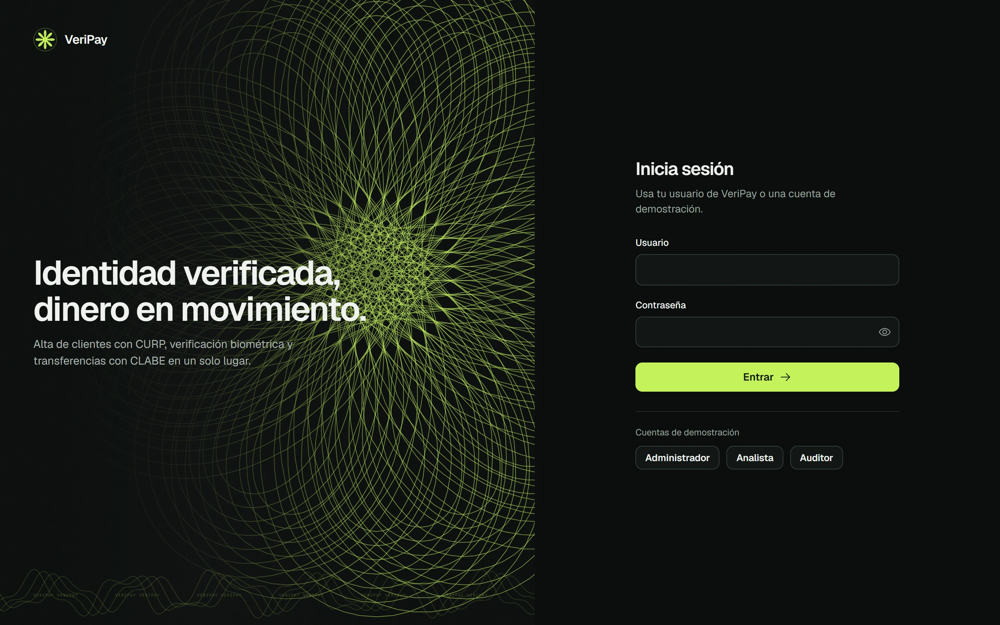
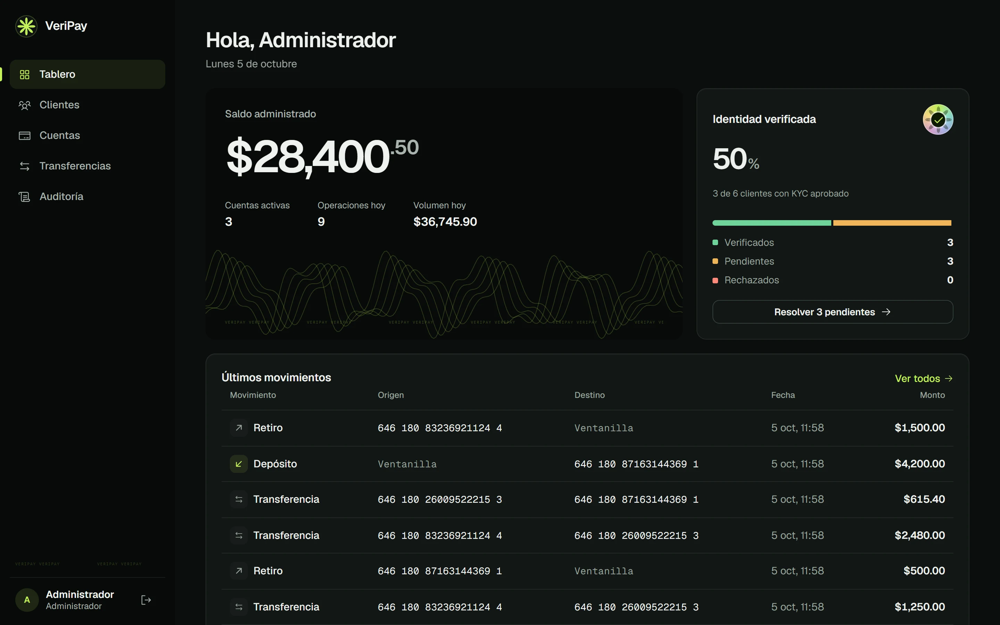
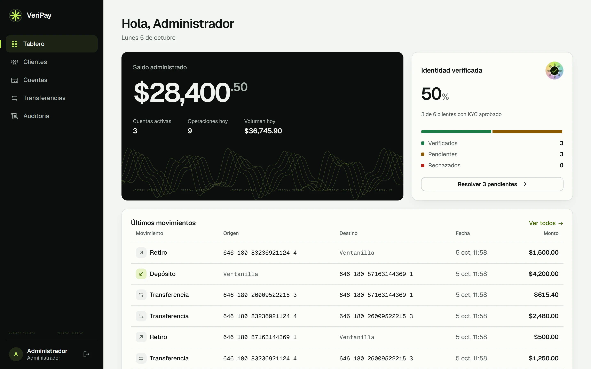
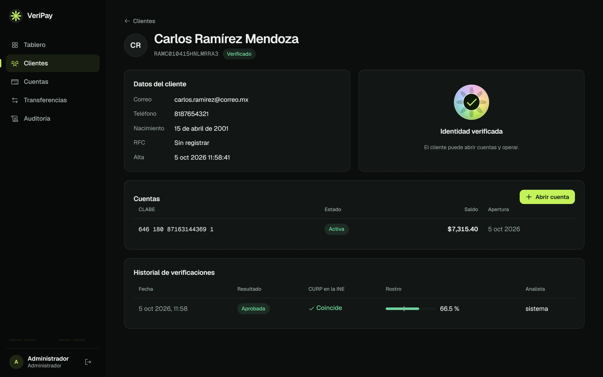
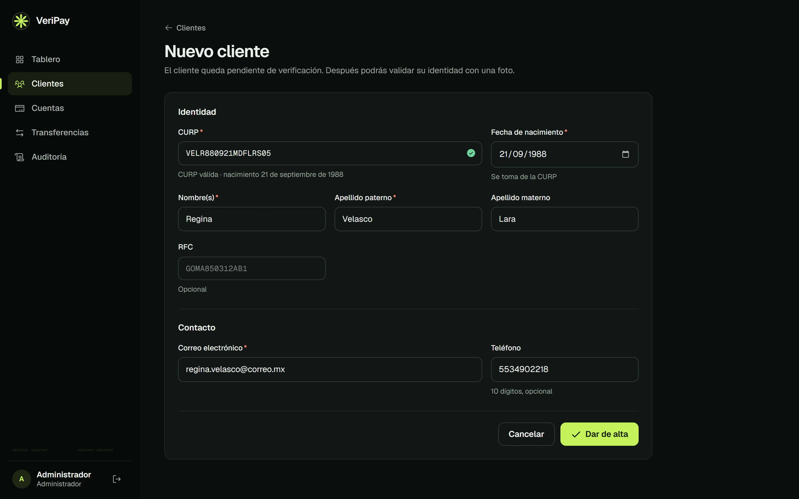
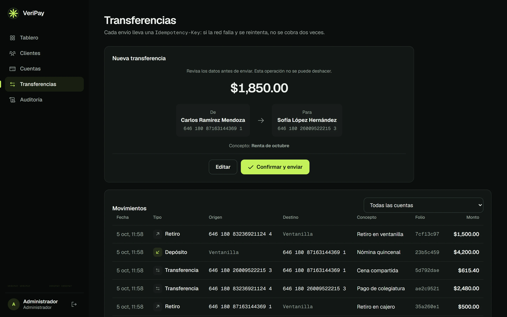
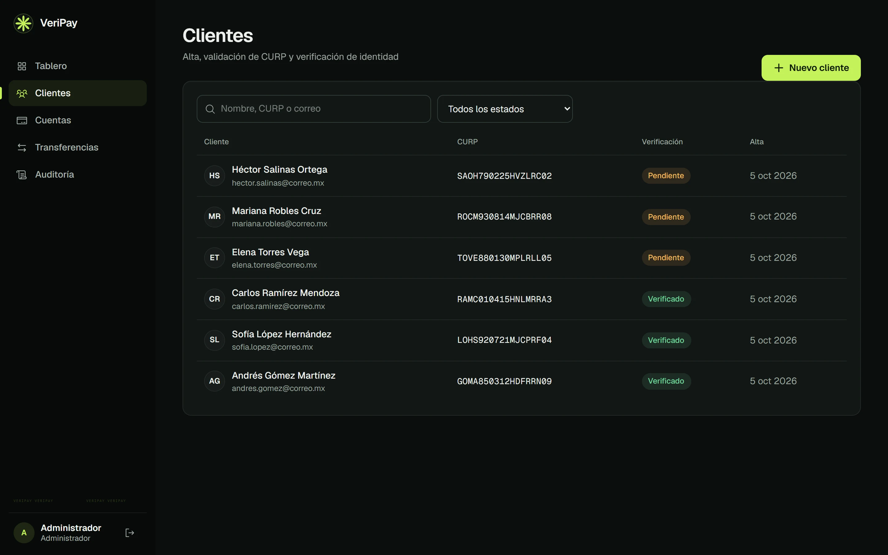
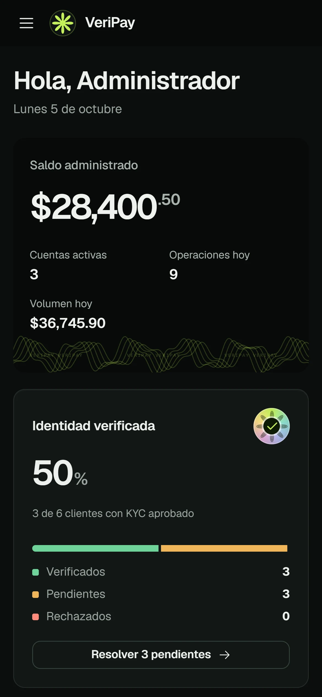

# VeriPay

Onboarding de clientes con validación de identidad y pagos electrónicos. Proyecto de portafolio con **Java 17, Spring Boot, JBoss/WildFly, SQL, Angular, HTML, CSS y TypeScript**, desarrollado en **Eclipse**.



## Qué hace

1. **Alta de clientes:** valida la CURP con el algoritmo de RENAPO (formato, entidad, fecha y dígito verificador), el RFC y la mayoría de edad.
2. **Verificación de identidad (KYC):** lee la CURP impresa en la INE (PP-OCRv3 + Tesseract, validada con el dígito verificador) y compara el rostro de la INE con una selfie (OpenCV YuNet + SFace). Se aprueba solo si la CURP es la del cliente y el rostro coincide. Guarda la huella SHA-256 de cada imagen, nunca la imagen.
3. **Cuentas con CLABE:** genera CLABE de 18 dígitos con dígito de control Banxico. Solo un cliente verificado abre cuenta.
4. **Pagos:** depósitos, retiros y transferencias con bloqueo pesimista ordenado, `Idempotency-Key` y límite por operación.
5. **Seguridad y auditoría:** JWT, tres roles y una bitácora de cada operación, incluidos los logins fallidos.

## Capturas

| Tablero | Tablero en modo claro |
|---|---|
|  |  |

| Cliente verificado | Alta con validación de CURP |
|---|---|
|  |  |

| Confirmación de transferencia | Clientes |
|---|---|
|  |  |

<p align="center"></p>

Datos de demostración: los nombres, CURP y CLABE son ficticios.

## Stack

| Capa | Tecnología |
|---|---|
| Backend | Spring Boot 3.3 (Web, Data JPA, Security, Validation), Hibernate |
| API | REST versionada (`/api/v1`), errores RFC 9457, OpenAPI y Swagger UI |
| Seguridad | Spring Security como OAuth2 Resource Server, JWT HS256, BCrypt |
| Base de datos | Migraciones Flyway sobre H2 (desarrollo) y PostgreSQL |
| Servidor | Un WAR para JBoss EAP / WildFly o Tomcat embebido |
| Frontend | Angular 20: componentes standalone, signals, formularios reactivos, interceptores y guards |
| Pruebas | JUnit 5, MockMvc, Spring Security Test, prueba de concurrencia; Jasmine y Karma en el frontend |

## Inicio rápido

**Backend en Eclipse:** `File → Import → Maven → Existing Maven Projects`, elige `backend/` y ejecuta `VeriPayApplication` como *Java Application*. Arranca en http://localhost:8080/veripay con H2 y datos demo.

**Frontend:**

```bash
cd frontend
npm install
npm start
```

Abre http://localhost:4200 y entra con `admin / Admin123!`, `analista / Analista123!` o `auditor / Auditor123!`. Estas cuentas solo existen en el perfil `dev`.

**Todo en un WAR:**

```bash
cd backend
mvn -Pfull clean package
java -jar target/veripay.war
```

PostgreSQL, WildFly y variables de entorno: [docs/operacion.md](docs/operacion.md).

## Ejemplo con curl

```bash
TOKEN=$(curl -s -X POST http://localhost:8080/veripay/api/v1/auth/login \
  -H "Content-Type: application/json" \
  -d '{"username":"admin","password":"Admin123!"}' | jq -r .token)

curl -H "Authorization: Bearer $TOKEN" http://localhost:8080/veripay/api/v1/tablero
```

## Endpoints

| Método | Ruta | Roles |
|---|---|---|
| POST | `/api/v1/auth/login` | público |
| GET | `/api/v1/clientes`, `/api/v1/clientes/{id}` | todos |
| POST | `/api/v1/clientes` | ADMIN, ANALISTA |
| PATCH | `/api/v1/clientes/{id}` | ADMIN, ANALISTA |
| POST | `/api/v1/clientes/{id}/verificaciones` | ADMIN, ANALISTA |
| GET | `/api/v1/clientes/{id}/verificaciones[/{verificacionId}]` | todos |
| POST | `/api/v1/clientes/{id}/cuentas` | ADMIN, ANALISTA |
| GET | `/api/v1/cuentas`, `/api/v1/cuentas/{id}` | todos |
| PATCH | `/api/v1/cuentas/{id}` | ADMIN |
| POST | `/api/v1/transacciones/depositos`, `/retiros`, `/transferencias` | ADMIN, ANALISTA |
| GET | `/api/v1/transacciones`, `/api/v1/transacciones/{folio}` | todos |
| GET | `/api/v1/tablero` | todos |
| GET | `/api/v1/auditoria` | ADMIN, AUDITOR |

Ejemplos de petición y respuesta, formato de errores y catálogo de códigos: [docs/api.md](docs/api.md).

## Documentación

| Documento | Contenido |
|---|---|
| [Arquitectura](docs/arquitectura.md) | Capas, flujo de una transferencia, modelo de datos, decisiones |
| [API](docs/api.md) | Convenciones REST, idempotencia, paginación, cada endpoint |
| [Reglas de negocio](docs/reglas-de-negocio.md) | CURP, KYC, CLABE, límites |
| [Seguridad](docs/seguridad.md) | JWT, roles, secretos, protecciones |
| [Operación](docs/operacion.md) | Instalación, perfiles, despliegue, pruebas, problemas comunes |
| [Auditoría](docs/auditoria.md) | 14 fallas y 8 desviaciones REST corregidas, verificación en WildFly y pendientes |

## Estructura

```
veripay/
├── backend/                   Proyecto Maven (se importa en Eclipse)
│   ├── src/main/java/com/veripay/
│   │   ├── auth/  usuario/    Login, JWT y usuarios
│   │   ├── cliente/           Clientes y CURP
│   │   ├── biometria/         KYC y comparador de imágenes
│   │   ├── cuenta/            Cuentas y CLABE
│   │   ├── transaccion/       Movimientos, idempotencia, tablero
│   │   ├── auditoria/         Bitácora
│   │   ├── config/            Seguridad, propiedades, datos iniciales
│   │   └── common/            Errores RFC 9457 y paginación
│   ├── src/main/resources/db/migration/   SQL de Flyway
│   ├── src/main/webapp/WEB-INF/           Descriptores de JBoss
│   └── wildfly/               Script del DataSource JNDI
├── frontend/                  Angular
├── docs/                      Documentación
└── docker-compose.yml         PostgreSQL
```
