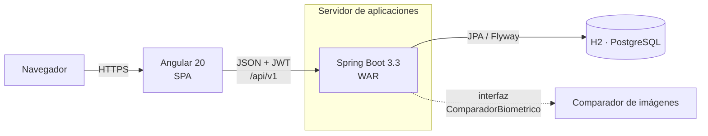
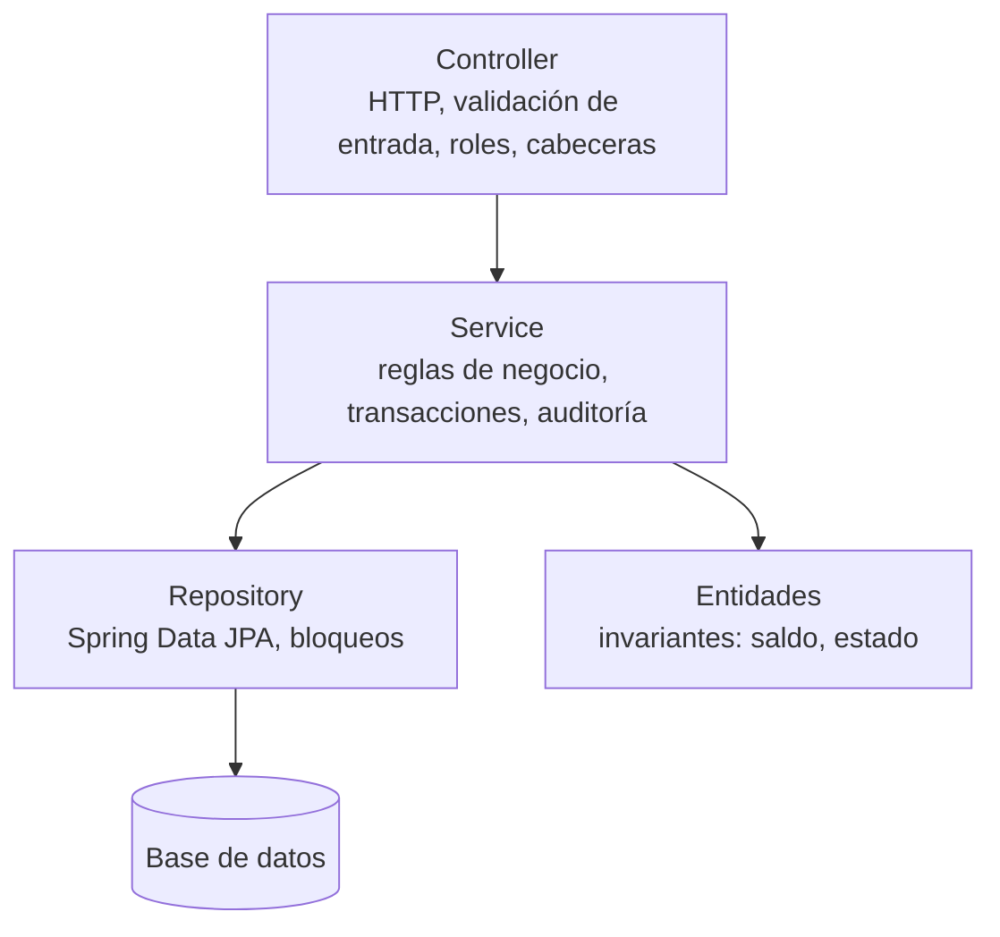
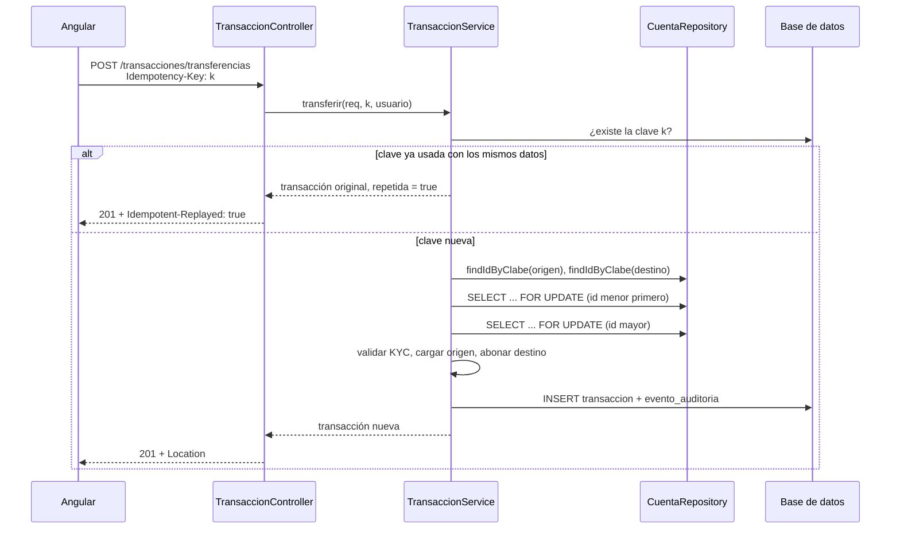
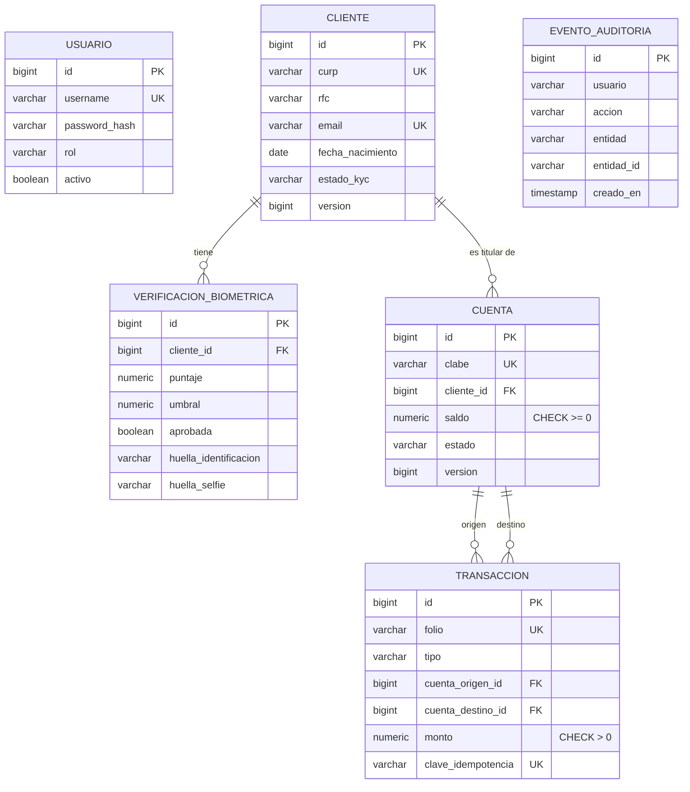

# Arquitectura

## Vista general

El backend se empaqueta como un solo WAR que incluye el frontend compilado. El mismo archivo corre de dos formas:

- `java -jar veripay.war`, con Tomcat embebido.
- Copiado a `standalone/deployments` de WildFly o JBoss EAP. `jboss-web.xml` fija el contexto en `/veripay`.

## Módulos del backend

Cada paquete agrupa un tema del negocio con su entidad, repositorio, servicio y controlador.

| Paquete | Responsabilidad |
|---|---|
| `auth` | Login y emisión del JWT |
| `usuario` | Usuarios del sistema y roles; `UsuarioDetailsService` para Spring Security |
| `cliente` | Alta y búsqueda de clientes, validación de CURP (`Curp`, `@CurpValida`) |
| `biometria` | Verificación KYC: `KycService` aplica las reglas y `ComparadorBiometrico` compara imágenes |
| `cuenta` | Cuentas, generación y validación de CLABE (`Clabe`) |
| `transaccion` | Depósitos, retiros, transferencias, idempotencia y tablero |
| `auditoria` | Bitácora de eventos |
| `config` | Seguridad, propiedades, OpenAPI, datos iniciales, reenvío de rutas del SPA |
| `common` | Errores RFC 9457 (`GlobalExceptionHandler`, `Problemas`), excepciones de negocio y paginación |

### Capas

- Los **controladores** no contienen reglas de negocio. Validan el formato con Bean Validation, revisan el rol con `@PreAuthorize` y arman la respuesta HTTP (`201`, `Location`, `Idempotent-Replayed`).
- Los **servicios** abren la transacción (`@Transactional`), aplican las reglas y registran el evento de auditoría dentro de la misma transacción: si la operación se revierte, el evento también.
- Las **entidades** protegen sus invariantes. `Cuenta.cargar` rechaza un saldo negativo y una cuenta bloqueada; el servicio no puede saltarse esa regla.
- La API expone **DTOs** (`record`), nunca entidades JPA.

## Flujo de una transferencia

Bloquear siempre en orden de id evita el interbloqueo entre A→B y B→A simultáneas. `findIdByClabe` devuelve solo el id: si cargara la entidad antes del `FOR UPDATE`, Hibernate reutilizaría esa copia sin refrescar y el saldo quedaría desactualizado. La prueba de concurrencia con 8 hilos encontró ese error.

## Modelo de datos

- Flyway crea el esquema desde `db/migration/V1__esquema_inicial.sql`. Hibernate corre con `ddl-auto=validate`: revisa que el mapeo coincida con las tablas y nunca las modifica.
- El SQL funciona igual en H2 (modo PostgreSQL) y en PostgreSQL 14 o superior.
- Los montos usan `NUMERIC(19,2)` en la base y `BigDecimal` en Java. Las restricciones `CHECK` son la última defensa si un error de código intentara un saldo negativo.
- `transaccion.clave_idempotencia` es única: dos peticiones simultáneas con la misma clave no pueden insertar dos veces.

## Frontend

| Carpeta | Contenido |
|---|---|
| `core/` | `AuthService` (sesión con signals), `authInterceptor` (agrega el JWT, cierra sesión ante un 401), `authGuard`, `ApiService` (una función por endpoint), modelos y validador de CURP |
| `layout/` | `Shell`: menú lateral filtrado por rol y barra superior |
| `pages/` | Una carpeta por pantalla, cargada bajo demanda (*lazy loading*) |

- Componentes standalone con control de flujo nuevo (`@if`, `@for`) y signals para el estado.
- Formularios reactivos con las mismas reglas que el backend. `validadores.ts` implementa el dígito verificador de la CURP con el mismo algoritmo que `Curp.java`.
- Las pantallas de depósito y transferencia generan un `Idempotency-Key` por operación y lo conservan si la petición falla, así un reintento no duplica el cargo. Si el usuario cambia algún dato, se genera una clave nueva.
- En desarrollo, `ng serve` redirige `/api` al backend con `proxy.conf.json`. En producción, el frontend se compila con `baseHref: /veripay/` y viaja dentro del WAR.

## Decisiones de diseño

| Decisión | Motivo |
|---|---|
| Un WAR para Tomcat y WildFly | La vacante pide JBoss. `SpringBootServletInitializer` y Tomcat en scope `provided` permiten desplegar el mismo artefacto en ambos. |
| Bloqueo pesimista en saldos | Con dinero, un reintento por conflicto optimista complica al cliente. El `FOR UPDATE` serializa solo las cuentas involucradas. |
| `ComparadorBiometrico` como interfaz | La comparación incluida es de demostración. Un proveedor real se conecta con una clase nueva sin tocar `KycService`. |
| Errores RFC 9457 | Es el estándar del IETF para errores HTTP y Spring 6 lo soporta de forma nativa. |
| Versión en la ruta | Es visible, fácil de enrutar en un proxy y de probar con `curl`. |
