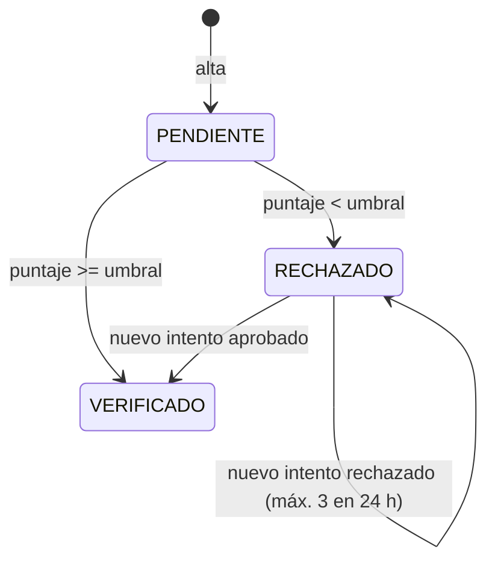

# Reglas de negocio

Cada regla indica la clase que la aplica y el código de error que produce.

## Alta de cliente

| Regla | Dónde | Error |
|---|---|---|
| La CURP cumple el formato de RENAPO y su dígito verificador es correcto | `Curp`, `@CurpValida` | 400 `VALIDACION` |
| La fecha de nacimiento coincide con la codificada en la CURP | `ClienteService.alta` | 422 `CURP_FECHA` |
| El cliente tiene 18 años o más | `ClienteService.alta` | 422 `MENOR_DE_EDAD` |
| La CURP no está registrada | `ClienteService.alta` + índice único | 409 `CURP_DUPLICADA` |
| El correo no está registrado (sin distinguir mayúsculas) | `ClienteService.alta` + índice único | 409 `EMAIL_DUPLICADO` |
| RFC opcional: 4 letras, 6 dígitos y 3 de homoclave | `AltaClienteRequest` | 400 `VALIDACION` |
| Teléfono opcional: 10 dígitos | `AltaClienteRequest` | 400 `VALIDACION` |

### Validación de la CURP

Una CURP tiene 18 caracteres: `GOMA850312HDFRRN09`.

| Posición | Ejemplo | Contenido |
|---|---|---|
| 1-4 | `GOMA` | Iniciales; la segunda es vocal o X |
| 5-10 | `850312` | Fecha de nacimiento AAMMDD |
| 11 | `H` | Sexo: H, M o X |
| 12-13 | `DF` | Entidad federativa (32 claves más `NE` para nacidos en el extranjero) |
| 14-16 | `RRN` | Consonantes internas |
| 17 | `0` | Homoclave: dígito para nacidos antes de 2000, letra desde 2000 |
| 18 | `9` | Dígito verificador |

El dígito verificador se calcula con el diccionario `0123456789ABCDEFGHIJKLMNÑOPQRSTUVWXYZ`: cada uno de los primeros 17 caracteres se multiplica por su valor en el diccionario y por `18 - posición`. El dígito es `10 - (suma mod 10)`, y un 10 se convierte en 0. El backend (`Curp.java`) y el frontend (`validadores.ts`) usan el mismo cálculo.

## Verificación de identidad (KYC)

| Regla | Dónde | Error |
|---|---|---|
| Un cliente verificado no se vuelve a verificar | `KycService` | 409 `KYC_YA_VERIFICADO` |
| Máximo 3 verificaciones rechazadas en 24 horas | `KycService` | 422 `KYC_INTENTOS_AGOTADOS` |
| La identificación y la selfie deben ser archivos distintos (SHA-256) | `KycService` | 422 `IMAGENES_IDENTICAS` |
| JPG o PNG legible, máximo 40 megapíxeles y 5 MB por archivo | `ComparadorPerceptual`, `spring.servlet.multipart` | 400 `ARGUMENTO_INVALIDO` / 413 |
| Se aprueba con un puntaje igual o mayor al umbral (0.80 por defecto) | `VerificacionBiometrica` | No aplica |

El sistema **no guarda las imágenes**. Guarda el puntaje, el umbral vigente, quién hizo la verificación y la huella SHA-256 de cada archivo, que basta para demostrar qué se comparó.

Dos verificaciones simultáneas del mismo cliente se procesan una tras otra: `KycService` bloquea la fila del cliente.

### Sobre el comparador incluido

`ComparadorPerceptual` reduce cada imagen a escala de grises y calcula dos hashes de 64 bits (aHash y dHash). El puntaje es el promedio de los bits que coinciden. Tolera cambios de tamaño, recompresión y ajustes de brillo. **No reconoce rostros**: dos fotos distintas de la misma persona pueden obtener un puntaje bajo, y una copia reencuadrada de la identificación puede pasar. En producción se reemplaza por un proveedor con reconocimiento facial y prueba de vida implementando `ComparadorBiometrico`.

## Cuentas

| Regla | Dónde | Error |
|---|---|---|
| Solo un cliente `VERIFICADO` abre cuentas | `CuentaService.abrir` | 422 `KYC_REQUERIDO` |
| Máximo 3 cuentas por cliente, también con aperturas simultáneas | `CuentaService.abrir` (bloquea al cliente) | 422 `LIMITE_CUENTAS` |
| La CLABE es única | `CuentaService.nuevaClabe` + índice único | No aplica (se genera otra) |
| Solo ADMIN bloquea o desbloquea | `CuentaController` | 403 `ACCESO_DENEGADO` |
| Una cuenta bloqueada no envía ni recibe dinero | `Cuenta.cargar`, `Cuenta.abonar` | 422 `CUENTA_BLOQUEADA` |

### CLABE

18 dígitos: banco (3) + plaza (3) + número de cuenta (11) + dígito de control (1). Banco y plaza vienen de `veripay.banco` en la configuración (`646` y `180` en esta demo). El número de cuenta sale de `SecureRandom`.

El dígito de control multiplica cada uno de los 17 primeros dígitos por los factores 3, 7, 1 (repetidos), toma el último dígito de cada producto, los suma y calcula `(10 - suma mod 10) mod 10`. Ejemplo verificado en `ClabeTest`: `032180000118359719`.

## Transacciones

| Regla | Dónde | Error |
|---|---|---|
| Monto mayor a 0 con máximo 2 decimales | `OperacionRequest`, `TransferenciaRequest` | 400 `VALIDACION` |
| Máximo $50,000.00 por operación | `TransaccionService.validarMonto` | 422 `LIMITE_EXCEDIDO` |
| Origen y destino distintos | `TransaccionService.transferir` | 422 `MISMA_CUENTA` |
| El saldo no queda negativo | `Cuenta.cargar` + `CHECK (saldo >= 0)` | 422 `SALDO_INSUFICIENTE` |
| Ambos titulares de una transferencia tienen KYC verificado | `TransaccionService.validarKyc` | 422 `KYC_REQUERIDO` |
| La CLABE existe | `TransaccionService.idDe` | 404 `NO_ENCONTRADO` |
| Una `Idempotency-Key` identifica una sola operación de un solo usuario | `TransaccionService.repeticion` | 422 `IDEMPOTENCIA_REUTILIZADA` |

Una transacción fallida no deja rastro: saldos, registro y evento de auditoría se revierten juntos.

## Auditoría

Cada evento guarda usuario, acción, entidad, id y un detalle corto.

| Acción | Cuándo |
|---|---|
| `LOGIN` | Inicio de sesión correcto |
| `LOGIN_FALLIDO` | Credenciales incorrectas (se guarda aunque el login falle) |
| `ALTA_CLIENTE`, `ACTUALIZA_CONTACTO` | Cambios en clientes |
| `KYC_APROBADO`, `KYC_RECHAZADO` | Resultado de una verificación, con puntaje y umbral |
| `APERTURA_CUENTA`, `BLOQUEO_CUENTA`, `DESBLOQUEO_CUENTA` | Cambios en cuentas |
| `DEPOSITO`, `RETIRO`, `TRANSFERENCIA` | Movimientos de dinero, con folio y monto |
